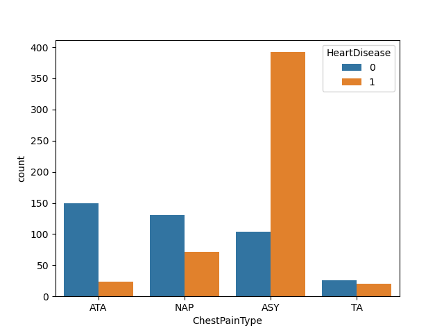
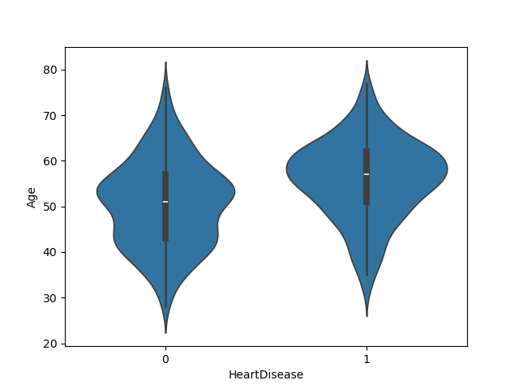
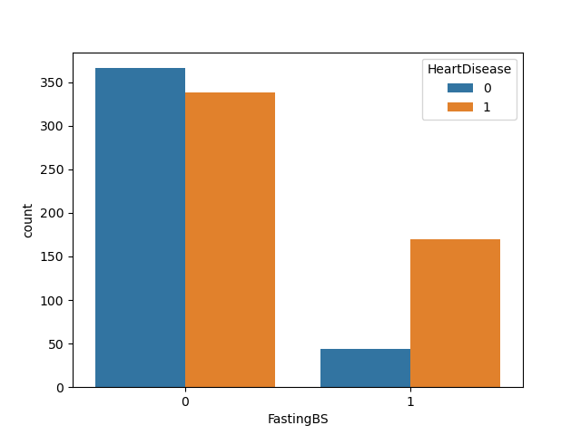
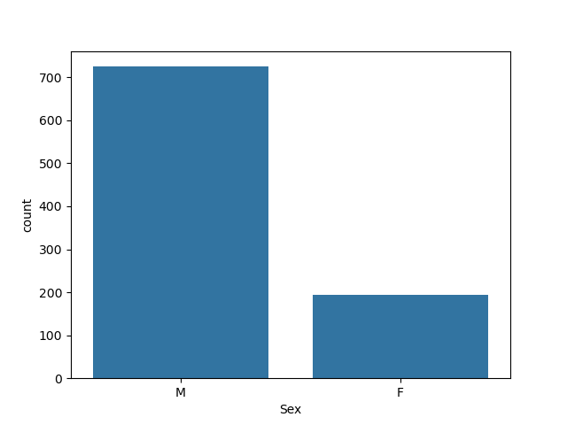
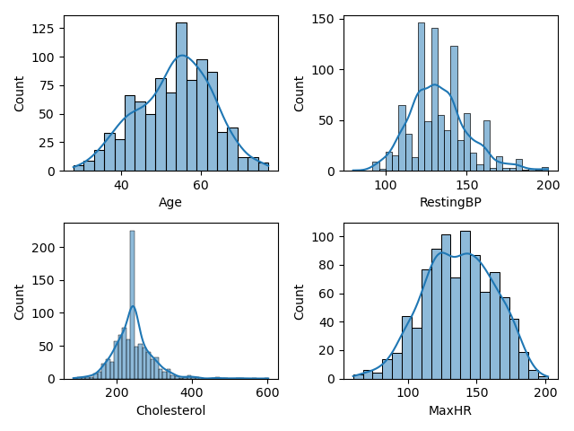
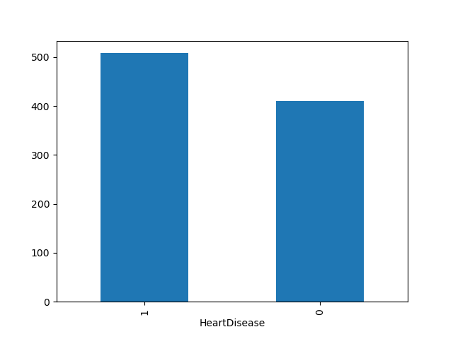
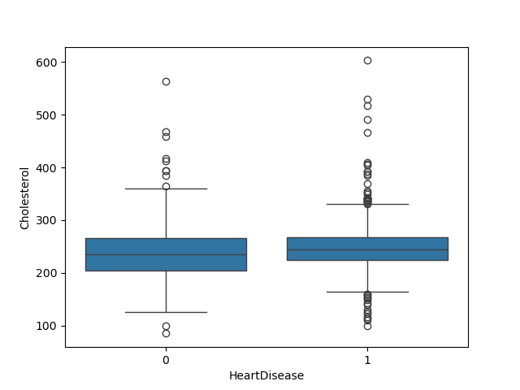
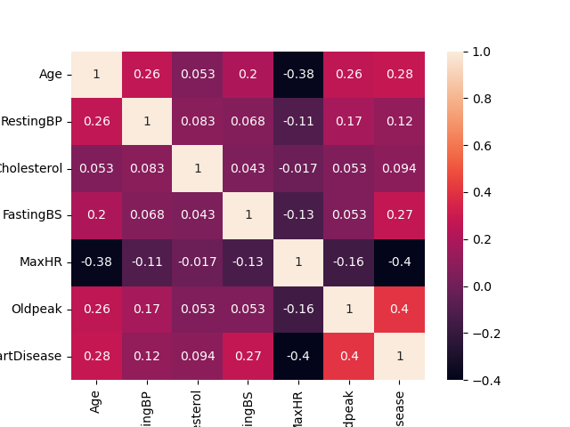

# ❤️ Heart Disease Prediction Project

GitHub repo size • GitHub stars • GitHub forks • Python Status

---

## 🌐 Live Demo

👉 **Click here to use the app:**  
🔗 https://fareha-heart-disease-prediction-app.streamlit.app/

This interactive Streamlit application allows users to:

* Enter patient medical details  
* Get instant heart disease prediction  
* Experience real-time ML model output  

---

## 📌 Overview

This project focuses on predicting the presence of heart disease using multiple Machine Learning algorithms. The goal is to analyze medical data, identify patterns, and build a predictive system for early detection.

---

## ⭐ Key Highlights

* Performed complete EDA on heart disease dataset  
* Built and compared multiple ML models  
* Achieved best performance using **KNN**  
* Evaluated models using Accuracy & F1 Score  
* Visualized data using Matplotlib & Seaborn  
* Deployed the model using Streamlit for real-time predictions 🚀  

---

## 📊 Dataset

The dataset contains medical attributes such as:

* Age  
* Sex  
* Chest Pain Type  
* Resting Blood Pressure  
* Cholesterol  
* Fasting Blood Sugar  
* Maximum Heart Rate  
* Exercise-Induced Angina  
* Oldpeak  
* ST Slope  

**Target Variable:**

* `0` → No Heart Disease  
* `1` → Heart Disease Present  

---

## 🚀 Installation

### 1️⃣ Clone the repository

git clone https://github.com/farehax/Heart-Disease-Prediction.git

cd Heart-Disease-Prediction

### 2️⃣ Install dependencies

pip install pandas numpy matplotlib seaborn scikit-learn streamlit

### 3️⃣ Run the app

streamlit run app.py

---

## 🔍 Methodology

### 1. Data Preprocessing

* Handled missing values  
* Converted categorical variables  
* Applied feature scaling  

---

### 2. Exploratory Data Analysis (EDA)

* Feature distribution plots  
* Target variable distribution  
* Correlation heatmap  
* Relationship analysis  

---

### 3. Model Building

Models used:

* Logistic Regression  
* K-Nearest Neighbors (KNN)  
* Naive Bayes  
* Decision Tree  
* Support Vector Machine (RBF Kernel)  

---

## 📈 Model Performance

| Model               | Accuracy   | F1 Score   |
|---------------------|-----------|-----------|
| Logistic Regression | 0.8750    | 0.8878    |
| KNN                 | **0.8859**| **0.8986**|
| Naive Bayes         | 0.8696    | 0.8788    |
| Decision Tree       | 0.7446    | 0.7513    |
| SVM (RBF Kernel)    | 0.8641    | 0.8804    |

---

## 🏆 Best Model

**K-Nearest Neighbors (KNN)** achieved the highest performance:

* Accuracy: **88.59%**  
* F1 Score: **0.8986**  

---

## 📊 Visualizations

### Chest Pain vs Heart Disease

### Age Distribution (Violin Plot)

### Cholesterol Boxplot

### Gender Distribution

### Feature Distribution

### Target Distribution

### Heart Disease vs Cholesterol

### Fasting Blood Sugar Count

### Correlation Heatmap

---

## 🛠️ Technologies Used

* Python  
* Pandas & NumPy  
* Matplotlib & Seaborn  
* Scikit-learn  
* Streamlit  

---

## 📌 Future Improvements

* Hyperparameter tuning  
* Use advanced models (Random Forest, XGBoost)  
* Improve UI/UX of Streamlit app  
* Deploy on cloud with scalability  

---

## 🙋‍♀️ Author

**Fareha Khan**

📫 Connect with me on LinkedIn  

---

## ⭐ Support

If you found this project useful, give it a ⭐ on GitHub!
